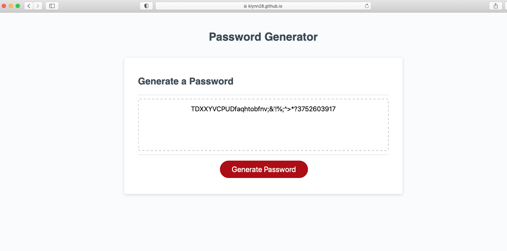

# password-generator

# Description

This project is creating a password generator on a webpage. The user can choose the length of their password from 8 to 128 characters. They also have the option to add lowercase, uppercase, special characters. The user will receive their new password, after choosing the criteria they would like and click the generate password button.

[Link to LIVE site](https://klynn28.github.io/password-generator/)

# Screenshots

